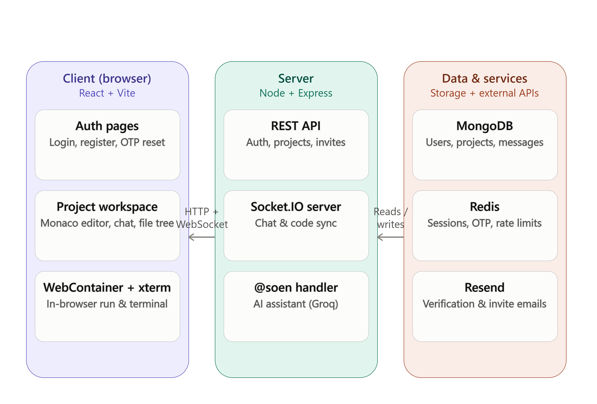

# SOEN 

A browser-based, real-time collaborative code editor that lets multiple developers write, run, and preview code together in the same project workspace, with an integrated AI assistant that can scaffold and modify project files on request.

## Overview

This application combines a live multi-user code editor, an in-browser execution environment, and an AI collaborator into a single workspace. Users create a project, invite collaborators, and edit code together with changes synced instantly across every connected client. A terminal and live preview run directly in the browser using a WebContainer, so projects can be installed, run, and viewed without any server-side execution. An AI assistant, invoked from the project chat, can generate or modify entire file trees on request, which are then synced to every collaborator in real time.

## Key Features

- **Real-time collaborative editing** — code changes are broadcast through Socket.IO and applied live to a shared Monaco editor across all collaborators.
- **Live file tree sync** — file and folder creation, edits, and deletion propagate instantly and drive both the editor and the running project.
- **In-browser execution and preview** — a WebContainer installs and runs the project directly in the browser, with a live preview rendered in an embedded iframe.
- **Integrated terminal** — an xterm.js terminal wired into the WebContainer for running commands, installing dependencies, or executing files.
- **AI assistant (@soen)** — invoked from project chat, generates or modifies a project's file tree from natural-language requests via the Groq API.
- **Project and collaborator management** — create projects, manage collaborators, and maintain independent chat history and file trees per project.
- **Authentication and session management** — JWT-based auth, with Redis managing logout and session invalidation.
- **Email verification** — account verification emails sent through Resend on a verified sending domain.

## How It Works

1. A user registers and verifies their account by email before signing in.
2. The user creates a project or is added to one by an existing collaborator.
3. Collaborators communicate in real-time chat and edit code together in a shared editor.
4. Addressing the AI assistant in chat returns a structured file tree, merged into the project and broadcast to all collaborators.
5. File and code changes from any source are synced to everyone in the project through Socket.IO.
6. The current file tree is mounted into a WebContainer; installing dependencies and starting the dev server produces a live preview.
7. A built-in terminal gives direct access to the same WebContainer for manual commands.

## Architecture

Real-time state flows through Socket.IO in both directions: the server broadcasts file tree and code-change events to all clients in a project room, and each client applies incoming changes to its local WebContainer and editor instance. The database remains the source of truth for a project's file tree and chat history, so newly joining collaborators are brought up to date on connection.

## Tech Stack

**Frontend:** React, Tailwind CSS, Monaco Editor, xterm.js, WebContainer API, Socket.IO client
**Backend:** Node.js, Express.js, Socket.IO
**Database:** MongoDB
**Session/Cache:** Redis
**AI Integration:** Groq API
**Email:** Resend
**Authentication:** JWT
**Deployment:** Render

## License

This project is licensed under the MIT License.